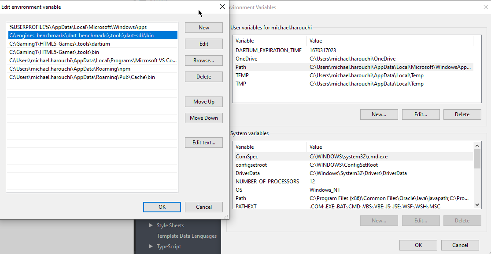

g1 stagexl benchmark dart 2.0
g1 stagexl benchmark dart 2.0
## Lancer des pages stageXL et PixiDart en Dart 2

#### A) Télécharger le SDK dart 2
Lien : [Dart 2.7.2](https://storage.googleapis.com/dart-archive/channels/stable/release/2.7.2/sdk/dartsdk-windows-ia32-release.zip)
Pour d'autres versions [utilisez ce lien]([https://dart.dev/tools/sdk/archive](https://dart.dev/tools/sdk/archive)).

#### B) Mettre le SDK dans un dossier .tools à la racine


Respectons les même pratiques que dans le repo HTML5,

#### C) Spécifier à WebStorm où se trouve le SDK

Si vous creez un nouveau projet, il vous sera demandé de localiser le SDK


Si ouvrez un projet déjà existant il vous faudra  spécifier l'endroit du SDK Dart 2 dans :
Settings => Languages & Frameworks => Dart


#### D) Mettre à jour la variable d'environement pour le path du sdk



N'oubliez pas de remettre à jour votre variable path si vous changez de version 

#### E) S'assurer que tout fonctionne en activant WebDev 

```
pub global activate webdev
