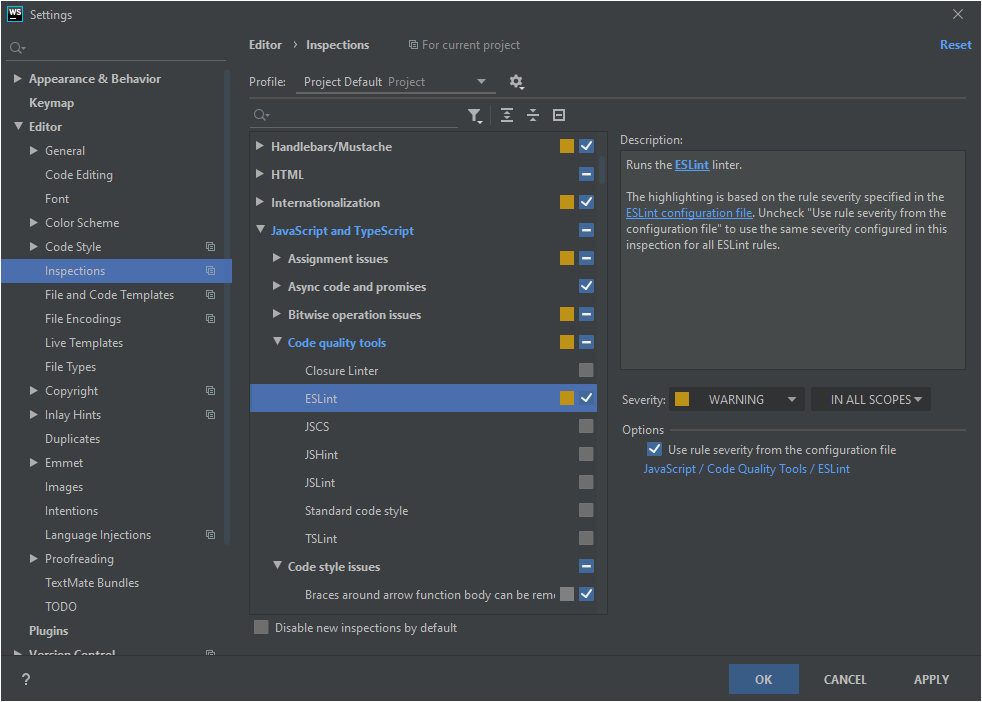
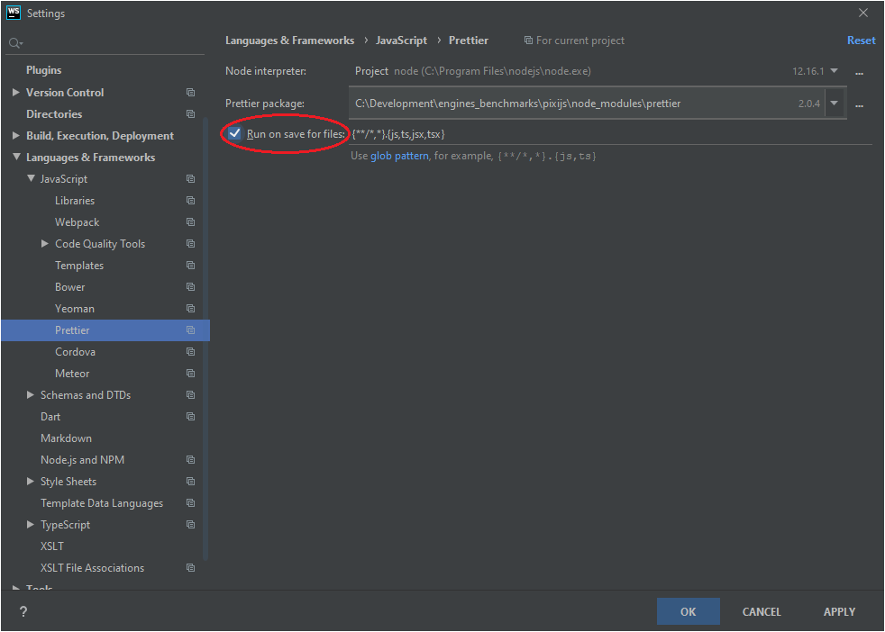

# TypeScript + PixiJS

## Configuration

### Installer NodeJS et NPM
Afin de tester l'environnement, vous devez avoir NodeJS et NPM installé sur votre machine.  
Ces deux outils peuvent être installés via l'[installateur de NodeJS](https://nodejs.org/en/download/).

### Installer les dépendences
Une fois Node et NPM installés, il faut télécharger les modules node utilisés par le projet.  
Pour cela exécuter la commande:

```npm install```

### Configurer WebStorm

#### Linter
Le linter [ESLint](https://eslint.org/) permet d'améliorer la qualité du code en uniformisant les bonnes pratiques syntaxiques. Sa configuration se trouve dans le fichier `.eslintrc.js`.  
WebStorm permet d'activer l'analyse statique du code basée sur ce linter:


[Prettier](https://prettier.io/) est un outil de formattage automatique du code. Sa configuration se trouve dans le fichier `.prettierrc.js`.  
WebStorm permet également d'activer cet outil afin qu'il reformatte le code à la sauvegarde (uniquement disponible dans les versions récentes de WebStorm).


## Utilisation
Afin de lancer le projet, exécuter la commande:

```npm run start```

Cette commande lance un serveur web en local et sert le projet à l'adresse [http://localhost:8080]().  
Les changements dans les fichiers du projet sont automatiquement détectés et lancent la recompilation du projet ainsi que le rafraîchissement de la page web.

## Plus d'information

### Webpack
Webpack est un _static module bundler_ pour JavaScript. Il permet de regrouper les différents modules d'un projet en un 
ou plusieurs bundle tout en gérant les dépendences entre ces modules.
- [Core concepts](https://webpack.js.org/concepts/)
- [Getting started](https://webpack.js.org/guides/getting-started/)
- [Webpack with TypeScript](https://webpack.js.org/guides/typescript/)

### TypeScript
TypeScript est une surcouche du JavaScript permettant le typage statique du code. Plus d'infos sur les [types](https://www.typescriptlang.org/docs/handbook/basic-types.html).

Comme pour les versions les plus récentes de JavaScript, TypeScript utilise le concept de [modules](https://www.typescriptlang.org/docs/handbook/modules.html).  
Il existe plusieurs façons de résoudre les modules pour TypeScript, la stratégie _Node_ est choisie pour ce projet. Plus d'informations sur la [résolution des modules](https://www.typescriptlang.org/docs/handbook/module-resolution.html).

TypeScript est compilé en JavaScript avant d'être interprété par le browser. Les configurations de compilation se trouvnent dans le fichier `tsconfig.json`. Des fichiers _sourcemaps_ sont générés afin de faciliter le débuggage dans la console.

## TODO

- ~~Ajouter un linter (https://eslint.org/blog/2019/01/future-typescript-eslint)~~
- Optimiser webpack (https://webpack.js.org/guides/build-performance/#typescript-loader)
- Gérer la mise en production (https://webpack.js.org/guides/production/)
- Comparer Parcel et Webpack (https://parceljs.org/)
- Resizer automatiquement le canvas
- Ajouter des tests unitaires (https://jestjs.io/, https://mochajs.org/, https://jasmine.github.io/, https://www.chaijs.com/)